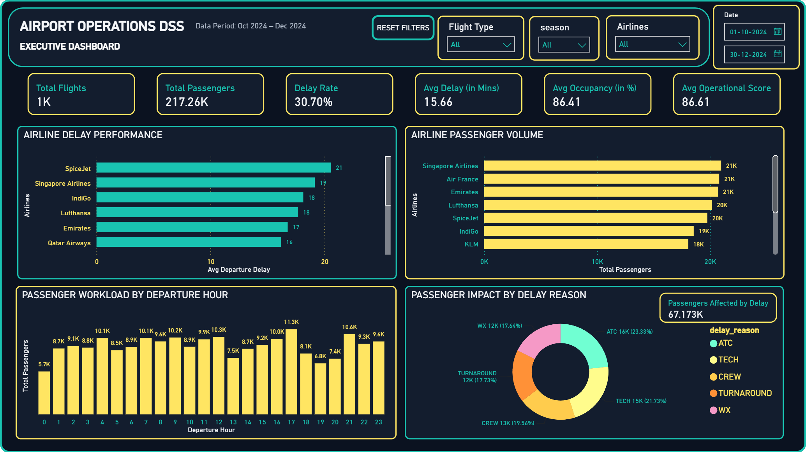
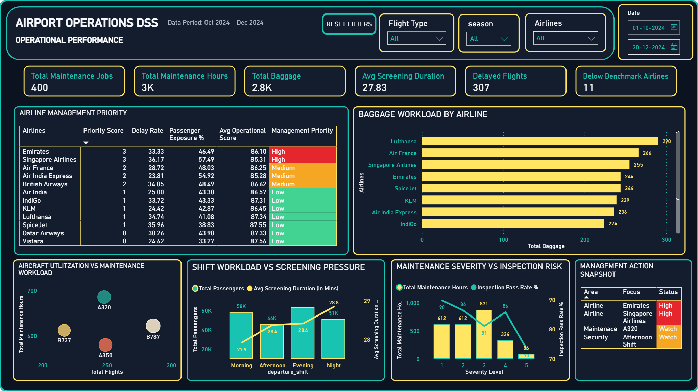
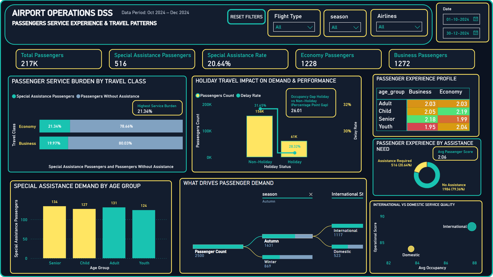

# ✈️ Airport Operations Decision Support System (DSS)

## 📌 Project Overview

This project is an end-to-end **Airport Operations Decision Support System (DSS)** built using MySQL and Power BI.

The project transforms raw airport operational data into structured, cleaned, and business-ready datasets and then converts them into an interactive Power BI dashboard for management-level analysis and decision-making.

The dashboard helps analyze:

- Flight operations and delays
- Passenger demand and service experience
- Airline performance
- Baggage workload
- Security screening pressure
- Aircraft utilization and maintenance
- Maintenance severity and inspection risk
- Staff deployment and overtime pressure
- Holiday, seasonal, and international travel patterns

The project follows a complete data analytics workflow from **database creation and data cleaning to business analysis and interactive dashboard reporting**.

---

## 🎯 Objectives

- Analyze overall airport operational performance.
- Identify airlines with higher delay and operational risk.
- Measure passenger workload and passenger impact of delays.
- Analyze baggage, security, gate, and maintenance operations.
- Evaluate aircraft utilization against maintenance workload.
- Identify passenger groups requiring greater service assistance.
- Analyze passenger experience across different passenger segments.
- Analyze staff deployment and overtime pressure.
- Understand holiday, seasonal, and international travel patterns.
- Build an interactive Power BI Decision Support Dashboard.

---

## 🛠️ Tools & Technologies

- MySQL
- SQL
- ETL & Data Cleaning
- Data Profiling
- Stored Procedures & SQL Views
- Power BI
- Power Query
- DAX
- Data Modeling
- Interactive Slicers
- Page Navigation
- KPI Cards & Business Visualizations

---

## 📂 Dataset Description

The project uses a structured airport operations dataset covering **October 2024 – December 2024**.

| Table | Description |
|---|---|
| `Flights` | Flight schedules, passengers, aircraft, delays, occupancy, operational score, season, holiday and international-flight information |
| `Passengers` | Passenger demographics, travel class, timestamps, special assistance and passenger score |
| `Baggage` | Baggage weight, status, priority, security and handling information |
| `Gate_Events` | Gate events, scheduled/actual timings, passengers processed and delay flags |
| `Security_Screening` | Screening timings, duration, results, capacity and screening indicators |
| `Staff_Shifts` | Staff departments, roles, shifts, hours, terminal allocation and overtime |
| `Maintenance_Logs` | Maintenance work, duration, severity, completion and inspection information |


---

# 🔄 What We Did in This Project

The project was developed as a complete analytics pipeline.

### 1. Database Creation
Created a dedicated MySQL database and structured tables for each airport operational domain.

### 2. Data Profiling
Profiled the source data to identify missing values, duplicates, invalid values, timestamp problems, and referential issues.

### 3. Data Cleaning
Cleaned and validated each operational dataset, including passenger scores, timestamps, delays, baggage data, security data, gate events, staff data and maintenance records.

### 4. ETL
Loaded transformed and cleaned records from staging/raw structures into the final operational tables.

### 5. Relationships
No Relationships were created due to lack of unique identifiers.
Indexes were created to have faster data retreival.

### 6. Business Analysis

**Level 1 — Basic Operations**

Focused on overall airport KPIs, airline flight volume, delays, occupancy and passenger workload.

**Level 2 — Operational Deep Dive**

Focused on baggage, aircraft utilization, maintenance, security screening and shift workload.

**Level 3 — Decision Support**

Focused on passenger impact, airline benchmarks, management priorities, maintenance risk, passenger assistance and workforce planning.

### 7. Power BI Dashboard
Connected the cleaned analytical data to Power BI and built a multi-page interactive Decision Support Dashboard.

---

# 🔢 SQL Script Execution Sequence

The SQL files are intentionally numbered because they must be executed in sequence.

### 01 — `01_Create_Database`
Creates the `Airport_Operations_DSS` database and initializes the project environment.

### 02 — `02_Create_Clean_Tables`
Creates the cleaned relational tables used by the project.

### 03 — `03_Data_Profiling`
Profiles the source data and identifies data-quality issues before cleaning.

### 04 — `04_ETL_Load`
Loads and transforms the cleaned data into the operational tables.

### 05 — `05_Create_Relationships`
Creates the required relationships between the operational tables.

### 06A — `06A_Flights_Cleaning`
Cleans and validates flight information, delays, occupancy and travel-context fields.

### 06B — `06B_Passengers_Cleaning`
Cleans passenger demographics, travel information, timestamps, assistance and passenger scores.

### 06C — `06C_Baggage_Cleaning`
Validates baggage weight, status, priority, security and handling information.

### 06D — `06D_Gate_Events_Cleaning`
Cleans and reconstructs gate-event timestamps and recalculates gate delay flags.

### 06E — `06E_Security_Screening_Cleaning`
Cleans and reconstructs the security screening workflow and recalculates screening duration.

### 06F — `06F_Staff_Shifts_Cleaning`
Validates staffing, departments, job roles, shifts, hours and overtime information.

### 06G — `06G_Maintenance_Logs_Cleaning`
Validates maintenance activity, duration, severity, completion and inspection information.

### 06H — `06H_StoredProcedures_&_Views`
Creates stored procedures and reusable analytical views used by later analysis and Power BI.

### 07A — `07A_Business_Analysis_Level1`
Performs the first level of business analysis:

- Overall airport KPIs
- Airline flight volume
- Airline delay performance
- Passenger workload
- Basic operational performance

### 07B — `07B_Business_Analysis_Level2`
Performs deeper operational analysis:

- Baggage workload
- Aircraft utilization
- Maintenance workload
- Security workload
- Shift workload
- Operational resource pressure

### 07C — `07C_Business_Analysis_Level3`
Performs decision-support analysis:

- Passenger impact by delay reason
- Airline benchmark analysis
- Management priority
- Maintenance severity and inspection risk
- Passenger assistance demand
- Passenger experience
- Workforce/staffing analysis

### SQL Sequence

```text
01 Create Database
        ↓
02 Create Clean Tables
        ↓
03 Data Profiling
        ↓
04 ETL Load
        ↓
05 Create Relationships
        ↓
06A–06H Cleaning / Views
        ↓
07A Business Analysis Level 1
        ↓
07B Business Analysis Level 2
        ↓
07C Business Analysis Level 3
        ↓
Power BI Dashboard
```


# 📊 Dashboard Features

## Key Performance Indicators (KPIs)

The dashboard includes KPIs such as:

- Total Flights
- Total Passengers
- Delay Rate
- Average Delay
- Average Occupancy
- Average Operational Score
- Maintenance Jobs
- Maintenance Hours
- Baggage Workload
- Delayed Flights
- Below-Benchmark Airlines
- Passenger Service & Travel Metrics

---

# 🖥️ Dashboard Pages

## Page 1 — Executive Overview

### 📌 Purpose

Provides a high-level overview of airport performance and the most important operational indicators.

### 📊 Main Analysis

- Overall airport KPIs
- Airline delay performance
- Airline passenger volume
- Passenger workload by departure hour
- Passenger impact by delay reason
- Passengers affected by delays

### 🔍 Key Questions

- How is the airport performing overall?
- Which airlines are experiencing higher delays?
- Which airlines handle the most passengers?
- When is passenger workload highest?
- Which delay reasons affect the greatest number of passengers?

### 📷 Dashboard Preview



---

## Page 2 — Operational Performance

### 📌 Purpose

Provides a deeper operational view focused on resource pressure, maintenance, baggage, screening and airline management priorities.

### 📊 Main Analysis

- Airline Management Priority
- Baggage Workload by Airline
- Aircraft Utilization vs Maintenance Workload
- Shift Workload vs Screening Pressure
- Maintenance Severity vs Inspection Risk
- Management Action Snapshot

### 🔍 Key Questions

- Which airlines fall below airport-wide benchmarks?
- Which airlines create the greatest baggage workload?
- Which aircraft models combine high utilization with maintenance workload?
- Which shifts experience greater screening pressure?
- Which maintenance severity levels need attention?
- What areas should management prioritize?

### 📷 Dashboard Preview



---

## Page 3 — Passenger & Service Planning

### 📌 Purpose

Analyzes passenger characteristics, passenger-service requirements, passenger experience and workforce planning.

### 📊 Main Analysis

- Special Assistance Demand by Age Group
- Passenger Service Burden by Travel Class
- Passenger Experience Profile
- Passenger Experience by Assistance Need
- Staff Workforce Structure
- Department Overtime Pressure

### 🔍 Key Questions

- Which passenger age groups require more assistance?
- Is service burden different across travel classes?
- How does passenger experience vary across segments?
- Do passengers requiring assistance report different experience scores?
- How is the workforce distributed across departments and job roles?
- Which departments have higher overtime pressure?

### 📷 Dashboard Preview



---

# 🔍 Key Insights

- A significant proportion of flights experience departure delays.
- Airline operational performance varies across multiple KPIs.
- Some airlines fall below airport-wide operational benchmarks.
- Passenger impact is not always proportional to the number of delayed flights.
- Baggage workload varies significantly between airlines.
- Aircraft utilization and maintenance workload differ by aircraft model.
- Security screening pressure varies across operating periods.
- Maintenance workload and inspection quality differ by severity level.
- Senior and child passenger groups show higher concentrations of special-assistance requirements.
- Passenger experience can be compared across travel classes and assistance groups.
- Staff deployment and overtime can be analyzed alongside passenger/service requirements.
- Holiday, international and seasonal travel patterns can be evaluated alongside occupancy, delays and operational performance.

---

# 📈 Business Value

This project demonstrates how raw airport operational data can be transformed into a structured **Decision Support System**.

The solution moves through:

**Raw Data → Clean Data → Business Metrics → Operational Analysis → Decision Support → Actionable Insights**

The dashboard is designed to help management identify operational pressure points, service requirements and areas requiring further attention.

---

# 🚀 Outcome

This project showcases practical skills in:

- SQL database development
- Data cleaning and validation
- ETL pipeline design
- Relational data modeling
- Business analysis
- KPI development
- DAX calculations
- Power BI dashboard development
- Interactive data visualization
- Decision-support analytics

The final output is an interactive **Airport Operations Decision Support System** connecting database engineering, analytical SQL and business intelligence into one complete project.
